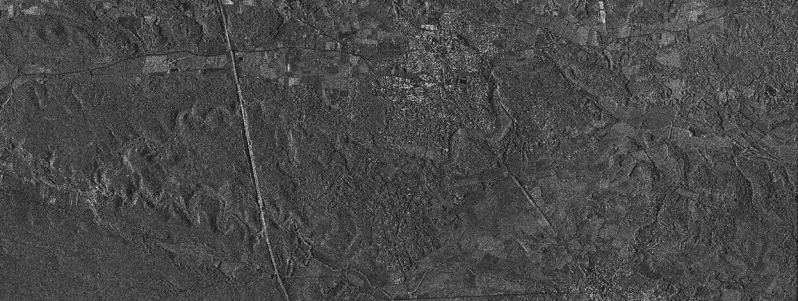
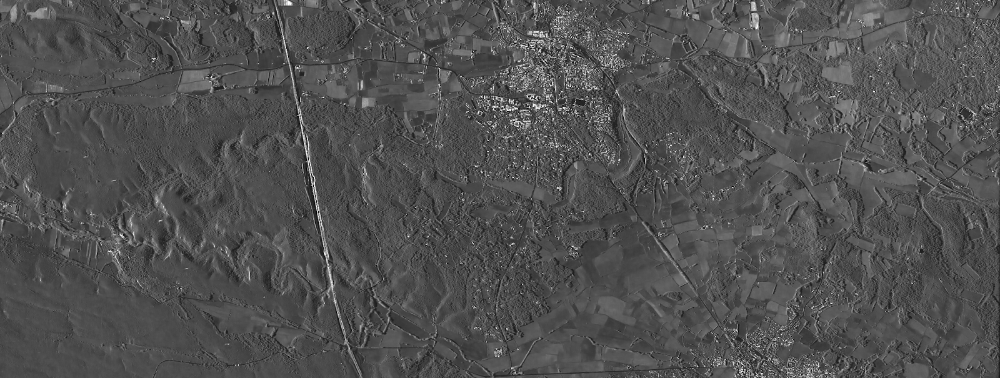
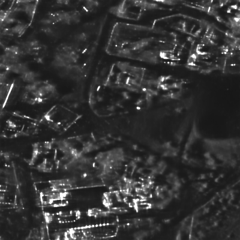
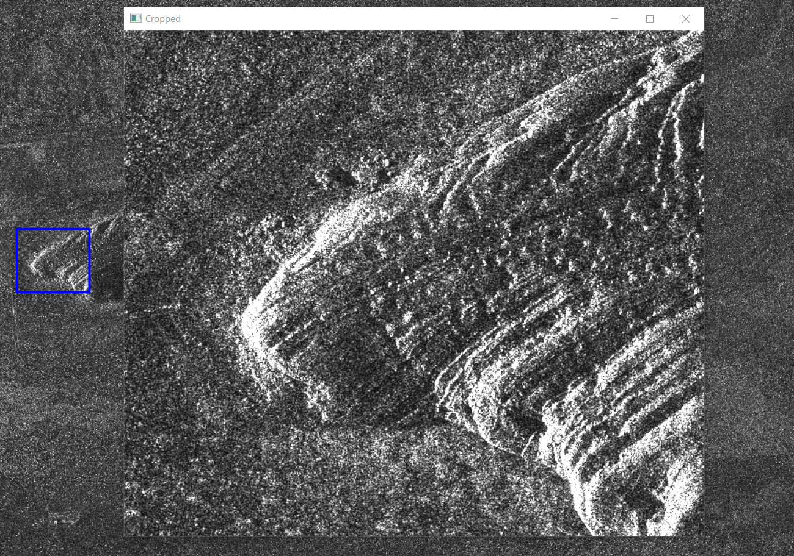
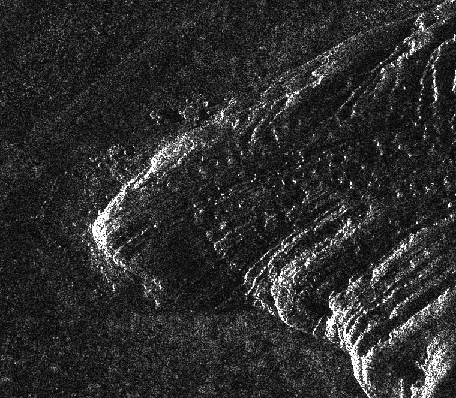
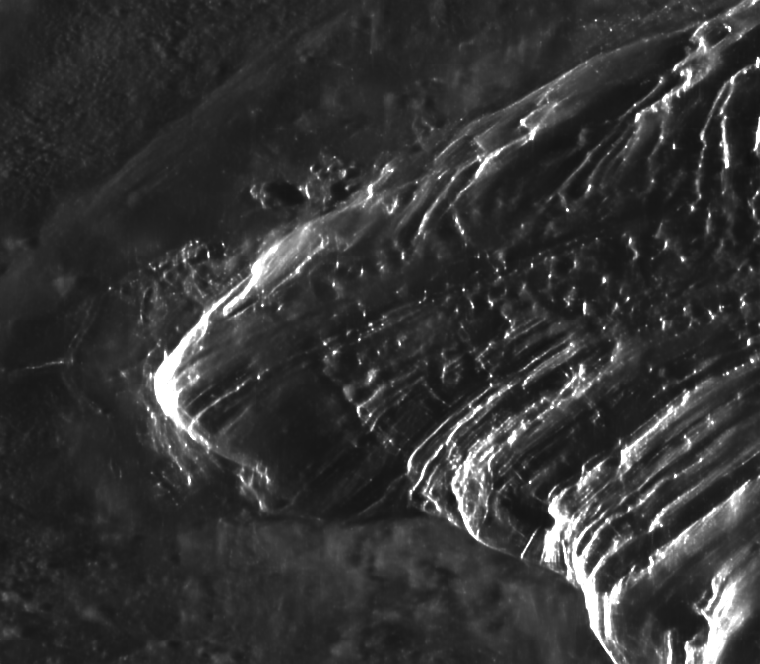
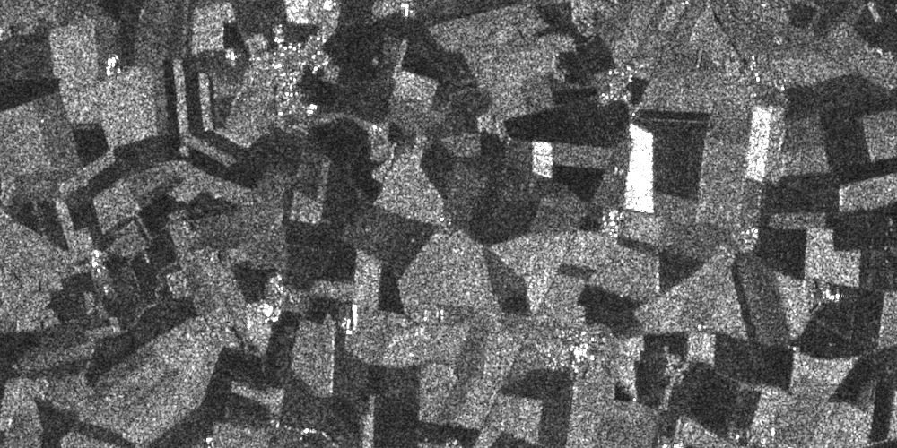

# deepdespeckling 

Speckle noise seriously limits the interpretability of synthetic aperture radar (SAR) images. This package provides <strong>deep learning based despeckling methods</strong> to denoise SAR images. 

<strong>deepdespeckling</strong> gives access to two differents methods: 

* [MERLIN](https://arxiv.org/pdf/2110.13148.pdf) (inference and training)
* [SAR2SAR](https://arxiv.org/pdf/2006.15037.pdf) (inference only)


[](https://badge.fury.io/py/deepdespeckling)
[](https://opensource.org/licenses/MIT)

## Installation

Before installing deepdespeckling, make sure to install gdal dependancies, it can be done using conda with the following command : 
```
conda install -c conda-forge gdal
```

Then, deepdespeckling can be installed simply using pip :

```python
pip install deepdespeckling
```


## Inference with MERLIN

To despeckle SAR images using MERLIN, images need to be in `.cos` or `.npy` format.

In order to get the right model, the `model_name` has to be specified in the `get_denoiser()` and the `get_model_weights_path()` functions calls.

This `model_name` can either be :
- `"spotlight"` for SAR images retrieved with spotlight mode 
- `"stripmap"` for SAR images retrieved with stripmap mode


### Despeckle one image with MERLIN

```python
from deepdespeckling.utils.load_cosar import cos2mat
from deepdespeckling.utils.constants import PATCH_SIZE, STRIDE_SIZE
from deepdespeckling.despeckling import get_model_weights_path, get_denoiser

# Path to one image (cos or npy file), can also be a folder of several images
image_path="path/to/cosar/image"
# Model name, can be "spotlight" or "stripmap"
model_name = "spotlight"

image = cos2mat(image_path).astype(np.float32)
# Get the right model
denoiser = get_denoiser(model_name=model_name)
model_weights_path = get_model_weights_path(model_name=model_name)

denoised_image = denoiser.denoise_image(
                image, model_weights_path, patch_size=PATCH_SIZE, stride_size=STRIDE_SIZE)
```

#### Symetrise parameter

During the preprocessing steps of the noisy image for MERLIN, the real and the imaginary parts are <strong>"symetrised"</strong> (to match the theoretical assumptions of MERLIN). 
However, we added a parameter to make this step optional (if one wants to implement their own symetrisation for example). 
To skip this step, just call :  

```python
denoised_image = denoiser.denoise_image(
                image, model_weights_path, patch_size=PATCH_SIZE, stride_size=STRIDE_SIZE,
                symetrise=False)
```

This parameter can also be added to the despeckling functions presented in the next section

### Despeckle a set of images using MERLIN

For each of this method, you can choose between 3 different functions to despeckle a set of SAR images contained in a folder : 

* `despeckle()` to despeckle full size images
* `despeckle_from_coordinates()` to despeckle a sub-part of the images defined by some coordinates
* `despeckle_from_crop()` to despeckle a sub-part of the images defined using a crop tool

#### Despeckle fullsize images

```python
from deepdespeckling.despeckling import despeckle

# Path to one image (cos or npy file), can also be a folder of several images
image_path="path/to/cosar/image"
# Folder where results are stored
destination_directory="path/where/to/save/results"

denoised_image = despeckle(image_path, destination_directory, model_name="spotlight")
```
Noisy image             |  Denoised image
:----------------------:|:-------------------------:
  |  

#### Despeckle parts of images using custom coordinates

```python
from deepdespeckling.despeckling import despeckle_from_coordinates

# Path to one image (cos or npy file), can also be a folder of several images
image_path="path/to/cosar/image"
# Folder where results are stored
destination_directory="path/where/to/save/results"
coordinates_dictionnary = {'x_start':2600,'y_start':1000,'x_end':3000,'y_end':1200}

denoised_image = despeckle_from_coordinates(image_path, coordinates_dict, destination_directory, model_name="spotlight")
```

Noisy image             |  Denoised image
:----------------------:|:-------------------------:
  |  

#### Despeckle parts of images using a crop tool

```python
from deepdespeckling.merlin.inference.despeckling import despeckle_from_crop

# Path to one image (cos or npy file), can also be a folder of several images
image_path="path/to/cosar/image"
# Folder where results are stored
destination_directory="path/where/to/save/results"
fixed = True "(it will crop a 256*256 image from the position of your click)" or False "(you will draw free-handly the area of your interest)"

denoised_image = despeckle_from_crop(image_path, destination_directory, model_name="spotlight", fixed=False)
```

* The cropping tool: Just select an area and press "q" when you are satisfied with the crop !

<p align="center">
  
</p>

* The results:

Noisy cropped image                     |           Denoised cropped image
:-----------------------------------------------------------:|:------------------------------------------:
  | 

## Inference with SAR2SAR

To despeckle SAR images using SAR2SAR, images need to be in `.tiff` or `.npy` format.

In order to get the right model, the `model_name` has to be specified in the `get_denoiser()` and the `get_model_weights_path()` functions calls.

The `model_name` has therefore to be set to `"sar2sar"`. Then, <strong>the despeckling functions (`despeckle, despeckle_from_coordinates, despeckle_from_crop`) work the same as with MERLIN.</strong>


### Despeckle one image with SAR2SAR

```python
from deepdespeckling.utils.load_cosar import cos2mat
from deepdespeckling.utils.constants import PATCH_SIZE, STRIDE_SIZE
from deepdespeckling.despeckling import get_model_weights_path, get_denoiser

# Path to one image (tiff or npy file), can also be a folder of several images
image_path="path/to/cosar/image"
# Model name, can be "spotlight" or "stripmap"
model_name = "sar2sar"

# Works exactly the same as with MERLIN
image = cos2mat(image_path).astype(np.float32)
# Get the right model
denoiser = get_denoiser(model_name=model_name)
model_weights_path = get_model_weights_path(model_name=model_name)

denoised_image = denoiser.denoise_image(
                image, model_weights_path, patch_size=PATCH_SIZE, stride_size=STRIDE_SIZE)
```

- Example of result with SAR2SAR :


Noisy image             |  Denoised image
:----------------------:|:-------------------------:
  |  


## Authors

* [Emanuele Dalsasso](https://emanueledalsasso.github.io/) (Researcher at ECEO, EPFL)
* [Hadrien Mariaccia](https://www.linkedin.com/in/hadrien-mar/) (Hi! PARIS Research Engineer)

## Former contributors 

* [Youcef Kemiche](https://www.linkedin.com/in/youcef-kemiche-3095b9174/) (Former Hi! PARIS Research Engineer)
* [Pierre Blanchard](https://www.linkedin.com/in/pierre-blanchard-28245462/) (Former Hi! PARIS Research Engineer)


# References

[1] DALSASSO, Emanuele, DENIS, Loïc, et TUPIN, Florence. [As if by magic: self-supervised training of deep despeckling networks with MERLIN](https://arxiv.org/pdf/2110.13148.pdf). IEEE Transactions on Geoscience and Remote Sensing, 2021, vol. 60, p. 1-13.

[2] DALSASSO, Emanuele, DENIS, Loïc, et TUPIN, Florence. [SAR2SAR: a semi-supervised despeckling algorithm for SAR images](https://arxiv.org/pdf/2006.15037.pdf). IEEE Journal of Selected Topics in Applied Earth Observations and Remote Sensing (Early Access), 2020
